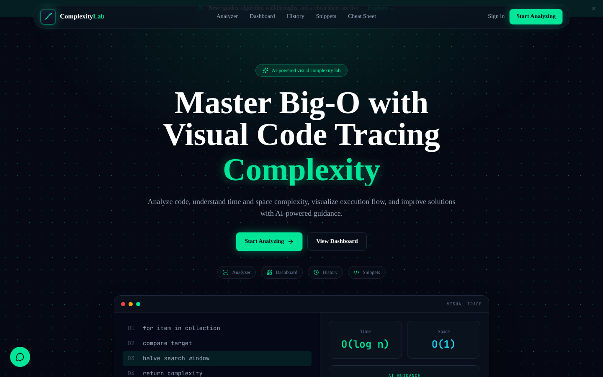
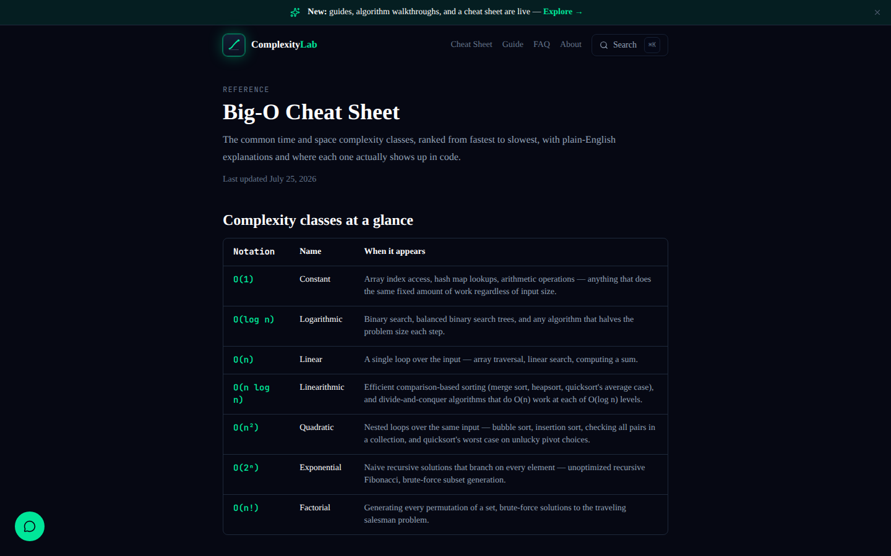
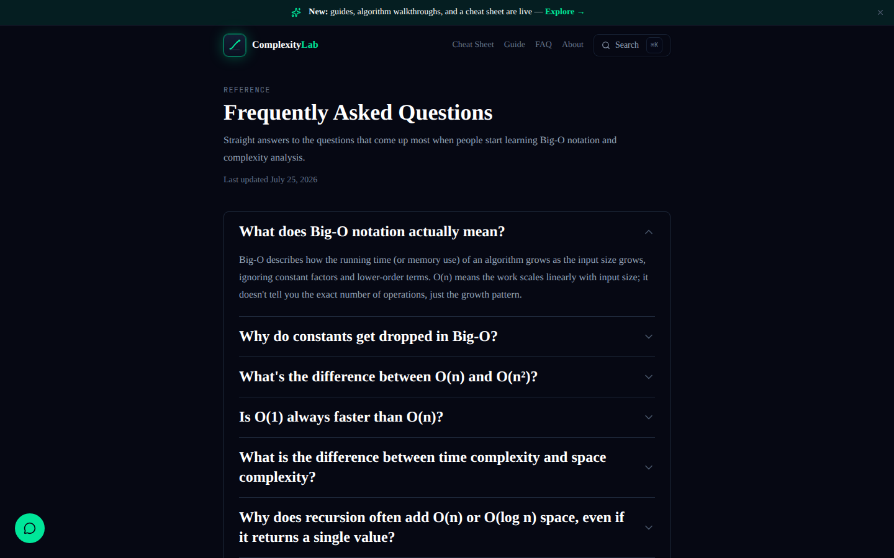
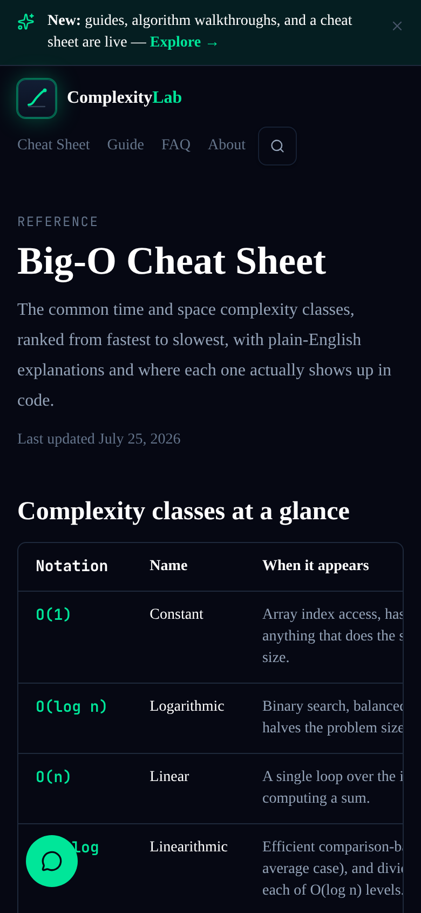
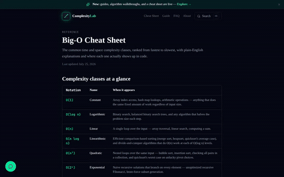

# ComplexityLab

An interactive web app for learning **algorithms and computational complexity**, with an AI-powered code analyzer, a code playground, an AI tutor, guided learning coaches, and per-user progress tracking.

Built by **Tirth Patel** ([@tirth6851](https://github.com/tirth6851)) and **Tirth Patel** ([@TirthPatel-10](https://github.com/TirthPatel-10)). Two friends who happen to share a name. See [Contributors](#contributors) below for an honest breakdown of who did what.

**Production:** https://www.complexitylab.top (also live at https://complexity-lab-eight.vercel.app). GitHub `main` auto-deploys, so pushing `main` deploys production.

[](https://github.com/tirth6851/ComplexityLab/actions/workflows/ci.yml)

---

## Screenshots

Captured from a real build of the app (the public marketing pages; the analyzer, dashboard, and other signed-in pages sit behind Clerk auth so they aren't shown here).

<p align="center">
  
</p>

<p align="center">
  
  
</p>

<p align="center">
  
</p>

**Site search in action** (Cmd/Ctrl+K, live-filtered results across every content page):

<p align="center">
  
</p>

---

## Features

| Feature | Description |
|---|---|
| **Analyzer** | Paste or upload code → get Big-O time + space complexity via Groq LLM with a deterministic heuristic fallback. Save results to your history. |
| **Analyses** | Browse and revisit every saved analysis with full detail view. |
| **Snippets** | Save reusable code snippets with tags. |
| **Playground** | Run code in 7 languages (Python, TypeScript, JavaScript, Java, Go, Rust, C++) via Judge0 CE. Send results straight to the AI tutor. |
| **AI Chat** | Streaming AI tutor powered by Groq. Context-aware: accepts handoffs from the Analyzer and Playground. 50 messages/day, 20/minute burst limit. |
| **Learning Hub** | Guided AI coaches: DSA, OOP, Git, CLI, and SQL, each with starter prompts and a specialized system prompt. |
| **Progress** | XP, levels, streaks, achievements, and a daily activity chart. |
| **Dashboard** | Personal stats: analyses run, languages used, top complexity class, streaks. |
| **Settings** | Display name, preferred language, account deletion. |

---

## Stack

- **Framework:** Next.js 16 (App Router) + TypeScript + Tailwind CSS
- **Auth:** Clerk (Google-only sign-in)
- **Database:** Supabase (Postgres with Row Level Security)
- **AI inference:** Groq (`llama-3.3-70b-versatile`) + deterministic heuristic fallback
- **Code execution:** Judge0 CE via RapidAPI
- **Deployment:** Vercel (auto-deploy from `main`, so pushing main deploys production)

---

## Getting started

```bash
cd frontend
cp .env.example .env.local   # fill in your real keys, see .env.example for details
npm install
npm run dev                  # http://localhost:3000
```

### Required environment variables

| Variable | Purpose |
|---|---|
| `NEXT_PUBLIC_CLERK_PUBLISHABLE_KEY` | Clerk auth (public) |
| `CLERK_SECRET_KEY` | Clerk auth (server-only) |
| `NEXT_PUBLIC_SUPABASE_URL` | Supabase project URL (public) |
| `NEXT_PUBLIC_SUPABASE_ANON_KEY` | Supabase anon key (public) |
| `SUPABASE_SERVICE_ROLE_KEY` | Supabase service-role key (**server-only, never expose to client**) |
| `GROQ_API_KEY` | Groq LLM inference (server-only) |
| `JUDGE0_API_KEY` | RapidAPI key for Judge0 CE code execution (server-only) |
| `NEXT_PUBLIC_APP_URL` | App base URL (e.g. `http://localhost:3000`) |

Optional: see `.env.example` for the full list with defaults: `AI_PROVIDER`, `GROQ_MODEL`,
`CHAT_PROVIDER`, `CHAT_MODEL`, `JUDGE0_ENABLED`, `JUDGE0_GLOBAL_DAILY_CAP`,
`JUDGE0_USER_DAILY_QUOTA`, and `UPSTASH_REDIS_REST_URL` / `UPSTASH_REDIS_REST_TOKEN`
(enables cross-instance rate limiting; unset = in-memory, per-instance).

---

## Development workflow

All commands run from `frontend/`:

```bash
npm run dev        # dev server → http://localhost:3000
npm run typecheck  # TypeScript strict check (0 errors required)
npm run lint       # ESLint 9 flat config (0 errors, 0 warnings required)
npm run build      # production build (all routes must compile)
npm run test       # Vitest, all tests must pass
```

All four gates must be green before any merge. `.github/workflows/ci.yml` runs the
same four gates on every push/PR to `main`.

---

## Architecture

```
Browser
  └── Next.js (App Router), frontend/
        ├── public: /, /about, /faq, /changelog, /complexity-cheatsheet,
        │           /algorithms/*, /guides/*, /sign-in, /sign-up,
        │           /sso-callback, /privacy, /terms
        ├── protected (app): /dashboard, /analyzer, /analyses/*, /snippets,
        │                    /chat, /playground, /progress, /settings/*,
        │                    /learning, /learning/{dsa,oop,git,cli,sql}
        │     └── auth enforced in proxy.ts (Clerk)
        ├── POST /api/analyze  → lib/ai → Groq → heuristic fallback
        ├── POST /api/execute  → lib/execute/judge0 → Judge0 CE
        ├── POST /api/chat     → lib/ai → Groq (streaming SSE)
        │                         ↳ coachType param selects DSA/OOP system prompt
        └── Server Actions     → lib/action-limit → lib/db → Supabase
```

Key invariants:
- `lib/db/admin.ts` imports `server-only`: a client import fails the build by design
- `proxy.ts`, not `middleware.ts`: the Next.js 16 convention in this project
- Route handlers + pages receive `params` as `Promise` (Next 16, must `await`)
- `DbResult<T>` never throws: pages always branch on `.ok`

---

## Security

- `.env.local` is git-ignored and must never be committed
- The Supabase **service-role key**, **Clerk secret key**, **Groq API key**, and **Judge0 API key** are server-only and must never reach the browser
- Every route handler: authenticated → validated → DB access
- Rate limits on every AI route (burst limit, Redis-backed globally when
  `UPSTASH_REDIS_REST_URL`/`UPSTASH_REDIS_REST_TOKEN` are set, else in-memory
  per-instance, plus a DB-backed daily quota)
- RLS deny-by-default on every Supabase table
- CI (`.github/workflows/ci.yml`) gates every push/PR to `main`

---

## Contributors

Pulled straight from `main`'s commit history via the GitHub API (account IDs, not just display names, since both contributors have used "Tirth Patel" as their git name at one point or another):

| Contributor | GitHub | Commits on `main` | Share of human commits |
|---|---|---|---|
| Tirth Patel | [@tirth6851](https://github.com/tirth6851) | 63 | ~64% |
| Tirth Patel | [@TirthPatel-10](https://github.com/TirthPatel-10) | 36 | ~36% |

This project was also built with heavy AI assistance from Claude Code throughout development. 24 additional commits on `main` are AI-authored, mostly larger feature integrations, testing, and infrastructure work, always reviewed and merged by a human. Counting those in, the full split across `main` is roughly 51% / 29% / 20% (tirth6851 / TirthPatel-10 / Claude).

Commit counts are a rough proxy, not a precise measure of effort. They don't capture pairing, design discussion, code review, or debugging done off-screen.
